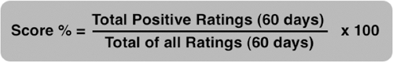
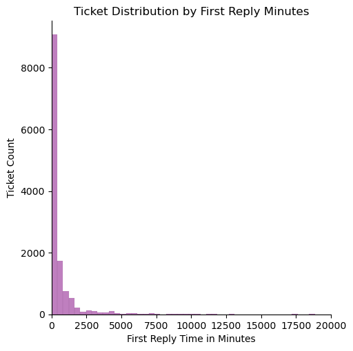
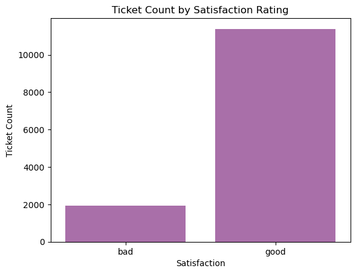
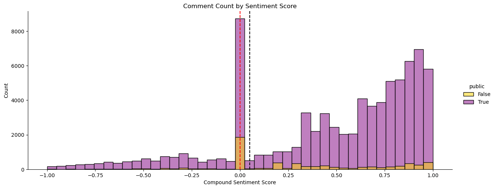
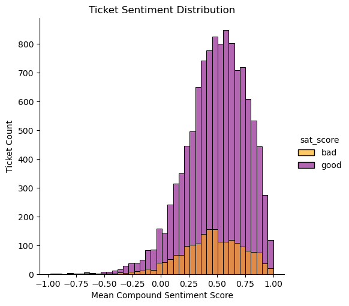
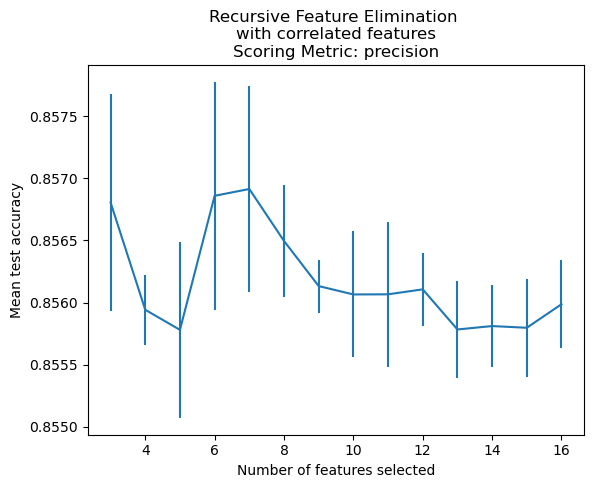
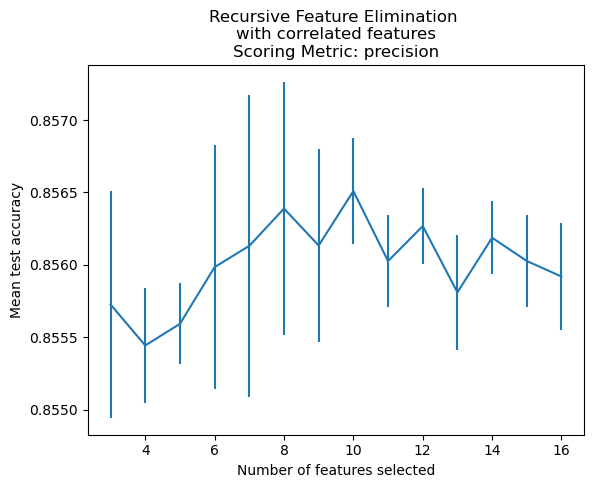
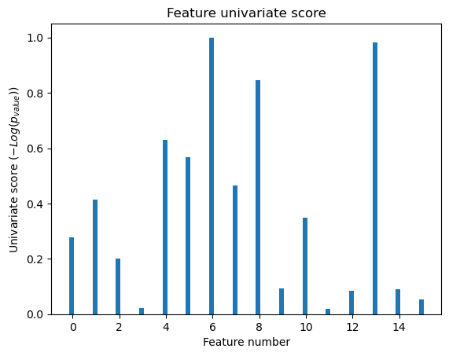
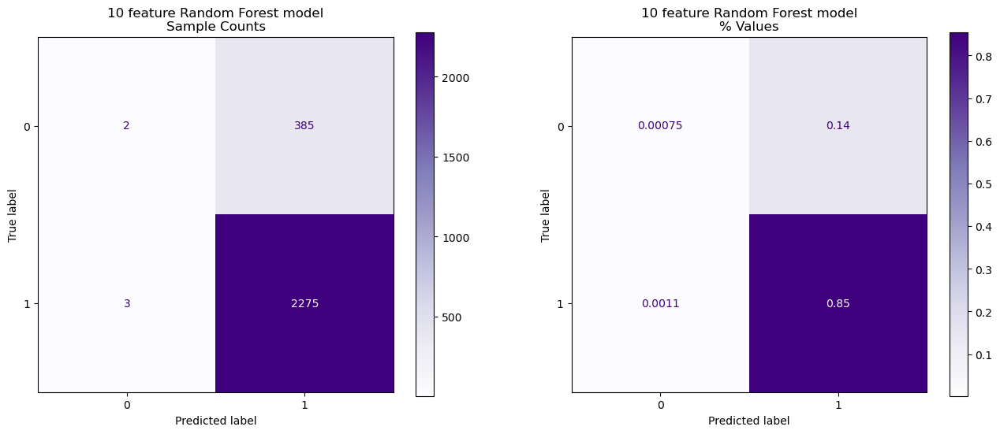
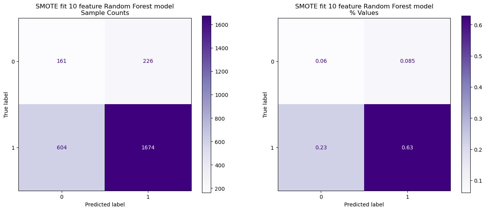

# Understanding Customer Satisfaction
<figure>

<figcaption><i>(Photo credit: Mohamed Mahmoud Hassan)</i></figcaption>
</figure>

## Executive Summary
As someone who has spent many years in and around various customer support teams, customer satisfaction (CSAT) has often been viewed as an essential metric to gauge the performance of the support team and individual team members.  Having this score is helpful as an indicator, but often the more difficult questions follow, such as "what impacts this score the most?" or "how do other metrics impact this score?" or "where should we focus efforts if we want to improve our scores?". 

Most CRM or support ticketing systems provide multiple metrics, reports, and dashboards.  Still, it is often difficult to sift through the entire data set and gather detailed insights that can help answer these questions in a quantifiable way.  Usually, you look through the charts and dashboards to try and identify trends and make causal connections that way, but it is not very scientific, and when challenged, it can tend to fall apart.  This is especially true in the environments that I've experienced where there are highly complex products and complex customers with a wide range of topics covered through support--primarily meaning that many tickets are not alike, which provides additional complication when trying to draw comparisons.

Having recently gained some data science knowledge and skills, this project aims to take real-world ticketing data from a company I am familiar with and build a classification model that predicts customer satisfaction.  The main goal of this model is to infer which features or metrics are impactful to customer satisfaction ratings for tickets and finally be able to quantify something that has seemed quite elusive.  If the model has powerful predictive capabilities, it may be operationalized in some other manner, but that is beyond this project's scope.  For this effort, ticket data was collected and analyzed, with an added dimension of NLP sentiment analysis of the ticket comments--messages between customers and the business to provide additional input to the model.

With the help of a former employer I got access to their ticketing system data in order to embark on the effort of building this model. This organization uses Zendesk for their customer ticketing, which employs a fairly simple mechanism to collect satisfaction data.  After a ticket is solved, the customer is sent a simple email survey that simply provides two options:
* 'Good, I'm satisfied'
* 'Bad, I'm unsatisfied'

They have the option to provide an additional comment specific to their rating, but those are not required.  After collection this data is generally used within Zendesk to calculate an actual CSAT score which ranges from 0% (bad) to 100% (perfect) for inclusion in various reports and dashboards.  The way it is calculated in Zendesk is as follows:

[source](https://support.zendesk.com/hc/en-us/articles/4408886173338-About-CSAT-Customer-Satisfaction-ratings-in-Zendesk-Support)

Although this model is not aimed at predicting the calculated score, the target being used is the "Good" or "Bad" rating, which would directly impact the overall CSAT score.  Being able to provide any quantifiable insights into which ticket metrics have what impact on these ratings would be valuable to the organization, which is why it is the focus of this project.

In the end, I was not able to build a model that provided a high degree of confidence in the results, or had predictive power over baseline.  With that in mind, I was able to extract some information, based on the model that was built, that indicates that the three areas of focus to maintain or improve CSAT ratings would be:
* Ticket activity (comments and replies frequency)
* The sentiment of the comments in the ticket (sentiment score)
* Full Resolution time of the ticket

Sources:
* [What is CSAT and how do you measure it?](https://www.qualtrics.com/experience-management/customer/what-is-csat/)
* [NPS, CSAT and CES - Customer Satisfaction Metrics to Track in 2022](https://www.retently.com/blog/customer-satisfaction-metrics/)
* [A Comprehensive Guide to Customer Satisfaction Score](https://www.helpscout.com/blog/customer-satisfaction-score/)
* [About CSAT (Customer Satisfaction) ratings in Zendesk Support](https://support.zendesk.com/hc/en-us/articles/4408886173338-About-CSAT-Customer-Satisfaction-ratings-in-Zendesk-Support)

## Description of Data

The data from this project is being collected through the [Zendesk APIs](https://developer.zendesk.com/api-reference/) as that is the ticketing system used by the organization I am working with.  I will be targeting data specific to tickets that are closed and rated, the details are in the `01_data_collection` notebook, but the overall approach is:
* Gather a list of all tickets with a satisfaction rating (good or bad)
* Gather the ticket metrics for all of the tickets with satisfaction rating
* Gather all comments from these tickets

NOTE: As this data contains sensitive information when this repo is made public, the data files will have been removed. So file references in the notebooks will no longer work.  However, if an API key is obtained, the entire data collection process can be undertaken again.  Running the data collection notebook and generating new files for the remaining notebooks would still work.

Over 13,300 solved and rated ticket metrics and over 85,000 comments were collected from the aforementioned API scripts.

### Notebooks
The following notebooks can be found in the code folder of this repo:
* `01_data_collection` - API scripts to retrieve data from Zendesk Support, but requires user and API key
* `02_data_cleaning `- Steps undertaken to clean the collected data
* `03_EDA` - Exploratory Data Analysis of the cleaned data
* `04_feature_engineering` - prepare data for modeling and engineer additional features
* `05_feature_selection` - algorithmic feature selection attempts after initial modeling performance
* `06_modeling` - Contains both final model and evaluation as well as inital model findings
* `07_supplemental` - ad-hoc notes and tests from investigation of imbalanced classes including SMOTE

### Data Dictionary

Belows is a description of the final ticket data that was used for modeling

|Name|	Type|Description|
|:--|:--|:--|
|sat_score|int64| (target) binary ticket satisfaction rating|
|grp_stations|int64|Number of groups the ticket passed through|
|asign_stations|int64|Number of assignees the ticket had|
|reopens|int64|Total number of times the ticket was reopened|
|replies|int64|The number of public replies added to a ticket by an agent|
|reply_mins|float64|Number of minutes to the first reply (calendar)|
|first_reso_mins|int64|Number of minutes to the first resolution time (calendar)|
|full_reso_mins|int64|Number of minutes to the full resolution (calendar)|
|agt_wait_mins|int64|Number of minutes the agent spent waiting (calendar)|
|reqstr_wait_mins|int64|Number of minutes the requester spent waiting (calendar)|
|on_hold_mins|int64|Number of minutes ticket was set to on hold status|
|sent_score|float64| Computed mean value of VADER sentiment score from all ticket comments|
|num_comms|int64| Computed count of total comments on the ticket|
|td_crtd_assnd|float64| Computed number of minutes between ticket creation and ticket assignment|
|td_assnd_slvd|float64|Computed number of minutes between ticket assignment and ticket resolution|
|rply_rate|float64|Computed replies divided by full resolution minutes|
|comm_rate|float64|Computed total comments divided by full resolution minutes|

## Project Approach

Below you will find summary information about what was carried out in each of the notebooks.  You can access the notebooks in the `code` directory of the repo for additional details.

### [`01_data_collection`](./code/01_data_collection.ipynb)
To collect the data of interest, it was a multistep process that involved:
* Querying the ticket system to find tickets that were closed and had a satisfcation rating and collecting summary information about those tickets, including ticket ID, from the search API
* Once the ticket IDs were obtained, the ticket metrics API was used to gather more detailed metric data about the ticket, such as minute counts, milestones, timestamps, etc.
* To obtain the complete comment data for the NLP sentiment analysis, the comments API was used to collect every comment from each ticket ID that was collected in the previous steps

Collecting and collating that data provided the groundwork to move forward.

### [`02_data_cleaning`](./code/02_data_cleaning.ipynb)
The raw data that was collected via the APIs was then checked for null or errant values, comment text had email addresses, urls, encoded characters, and more removed.  However, some typical targets for NLP analysis like performing lemmatization, or standardizing case, or removing punctuation were not performed due to some of the documentation for the [VADER sentiment analysis](https://github.com/cjhutto/vaderSentiment) that what was going to be used.  For example, it can understand things like emojis or all UPPER CASE words and can interpret sentiment behind those, so removing punctuation, etc. may have impacted that functionality.

In addition, certain elements like timestamps needed to be converted to specific datatypes, features were renamed for consistency and length.  Any features that were not going to be useful for analysis and modeling were removed to make the data prepared for the subsequent phases of the project.  Along these lines, I opted to gather the NLP sentiment analysis using VADER at this point in the cleaning phase.  I created a compound sentiment score for each of the over 85,000 comments, and then took the mean of all those scores on a per-ticket ID basis and merged that value back to the ticket data, as well as leaving it on the comment data for additional analysis.

The cleaned data, including the sentiment analysis was then exported for use in the exploratory data analysis (EDA) phase.

### [`03_EDA`](./code/03_EDA.ipynb)
Cleaned data was looked through closely, to see what insights might be uncovered.  There is additional detail in the notebook, but below are some examples of what was found and some interesting insights.  

#### Feature Distributions
Overall, the data collected from rated tickets had many similarities across almost all the features that were examined.  Most of their values were highly concentrated in a single area, had a very large range, and had high positive skews with long right tails, so it was not normally distributed.  

Example: Distribution of initial response time in minutes:

>The above plot is actually a closer look at a larger plot, and is only showing less that 2 standard deviations above the mean and the range goes to over 400k minutes.  Almost every feature in the data had this sort of characteristic.  

#### Class Imbalance
Beyond the similar distributions of the features, another aspect that was found was class imbalance.  The target for this project is the satisfaction rating of "good" or "bad", and the breakdown was a little over 85% for "good".  Overall, this is most likely a positive sign for the business that the majority of the rated tickets in their system are positive:

#### Sentiment Analysis
Another element that was added to this project was performing sentiment analysis on every comment of the ticket, both from customers and employees, which was rolled up as an average on a per-ticket basis to create the sentiment score for the ticket.  What was found during EDA is that the majority of comment sentiments were neutral or positive:

>In the plot above, the red and black dotted lines represent the edges of the "neutral" sentiment score.  Above the black line are positive, below the red line are negative.  You can see the majority is centered around neutral, but a large number of comments are in the positive range, which is most likely another positive aspect for the business to understand.

This translates to the tickets as such:

> Here, you can see how the large amount of comment sentiment translates into tickets.  It does appear that the "bad" score sentiment peaks slightly lower on the sentiment scale than the good tickets--but overall it's still well in the 'postive' sentiment range (above 0.05).

#### A "Typical" Ticket
Using data that was collected throughout EDA, the typical ticket in this data, using median values due to the spread of the data, has the following characteristics:
* Is submitted through the web form
* Stays assigned to one internal group/team and one agent
* Has 2 replies to the customer and 4 comments total
* Is not re-opened after being solved
* First reply in 209 minutes / 3.5 hours (calendar) 
* Resolution in 7454 minutes / 5.2 days (calendar)
* Agent waits 3870 minutes / 2.7 days (calendar)
* Requester waits 932 minutes / 15.5 hours (calendar)

#### EDA Summary
* Class imbalance may be an issue for modeling
    * Overall, I think it is positive that the majority of the ticket ratings are 'good', but could provide a challenge
* Feature distributions
    * As mentioned above, the majority of the features are highly-skewed and non-normal, which is also a challenge for modeling
* Comment and ticket sentiment is overwhelming non-negative
    * The majority of the comments and tickets were classified as neutral or positive
* No clear relationships between any individual feature and the target

### [`04_feature_engineering`](./code/04_feature_engineering.ipynb)
The metric data that is collected by Zendesk is quite extensive and covers most of attributes of tickets that are standard, like first reply time, resolution time, how many replies, etc.  Although it occurred before this notebook, I do consider the NLP sentiment analysis scoring part of feature engineering.  It was discussed previously, but being able to add some additional context beyond some of the numeric metric data is an interesting approach.

Beyond the sentiment analysis, I also computed and added the following features, that I thought may be interesting and useful to the model:
* Number of comments (`num_comms`) - Slightly different from the replies count, this totals all comments on tickets and not just public replies sent to the customer.  It would additionally represent customer comments and internal comments by employees.
* Time delta created to assigned (`td_crtd_assnd`) - Although many time elements are captured, there wasn't one from ticket creation to assignment
* Time delta assigned to solved (`td_assnd_slvd`) - Time between when the ticket was assigned to when it was solved
* Reply frequency (`rply_rate`) - Number of public replies to the customer divided by the time for resolution
* Comment frequency (`comm_rate`) - Very similar to the reply frequency, but encompasses all comments divided by the time for resolution

### [`05_feature_selection`](./code/05_feature_selection.ipynb)
The initial model that was built did not have much predictive power above baseline (< 1%).  After attempting ad-hoc class smapling and SMOTE to try and rule out class imbalance as the main reason for the model performance, it was clear that I needed to try other approaches.  This notebook uses various algorithmic techniques provided by scikit learn for feature selection.  I tried tree-based feature selection, recursive feature elimination (RFE), and univariate feature selection.  For reference, here are links to their documentation:
* [Tree-based feature selection](https://scikit-learn.org/stable/modules/feature_selection.html#select-from-model)
* [Recursive Feature Elimination (RFE)](https://scikit-learn.org/stable/modules/feature_selection.html#recursive-feature-elimination)
* [Univariate feature selection](https://scikit-learn.org/stable/modules/feature_selection.html#univariate-feature-selection)

If an estimator was required for the approach, I used the `rf_nine` model, which was derived from my initial modeling attempts to tune hyperparameters.

#### Tree-based Feature Selection
The first method I used was the tree-based feature selection.  Because the model I had created was a random forest and does have feature importances, which are used for feature selection, it was fairly straightforward to try this, although I only used the default settings and did not attempt to tune, as I planned to try all three methods and compare their results. The documentation states that _"Features whose absolute importance value is greater or equal are kept while the others are discarded."_  The default method to calculate that threshold is the mean of the absolute importance values.  When used with my model, it reduced the feature space from 16 to 10 features.

#### Recursive Feature Elimination (RFE)
The next method I tried was RFE, which works by operating on smaller and smaller feature sets to find the best features.  Like the tree-based method, it also uses feature importances.  It starts with fitting all the features, removes the least important, fits the remaining features and repeats the process until the desired number of features is met.  I used the cross-validation variant (`RFECV`) which tunes the amount of features automatically.

You can set which metric is used for the scoring in the cross-validation to try to optimize for certain scenarios.  Since I had seen some swings during my ad-hoc imbalance tests I tried various metrics to see how the results may change.  The default metric is accuracy, but I tried `f1`, `balanced_accuracy` (for dealing with imbalanced classes), and `precision` with the thought that if I found features that optimized for these metrics, it may help with the class imbalance and model performance.

What I found was that when I would run the same code multiple times, I would get different results.  The number of features selected could bounce around anywhere from 5 to 12, even when using the same scoring metric.  This continues to lead me to believe that much of the issue that I'm facing is with the underlying data, and the model is very sensitive to changes in the data samples that were being selected each run.  The results can be plotted, so you can see how it works through the process:

> The top plot is from a run where the RFECV process selected 7 features as the optimal number, whereas the bottom plot is where it chose 10.  Both are using precision as the metric, but you can see how it changes over the iterations, including the range of scores seen by the error bars (vertical lines).

#### Univariate feature selection
The last method that I tried was univariate feature selection.  As the name implies, it uses univariate statistical testing to determine which features to select.  There are various approaches, but I used the ANOVA F-test, which was suggested for classification, for the scoring function.  This method scores each feature compared to the target.  So after running, you can plot that data:

> This plot has the index of the feature as fed to the estimator on the x-axis, and the score, where higher bars are more important features, on the y-axis.

With this data you can either visually choose the features, or you can tell the method how many features you want.  

#### Feature Selection Summary
Although the tree-based method and the univariate method provided consistent results, the RFE, which seemed the most interesting to me, produced a variety of results.  How I approached this, was comparing some of the outputs between the various metrics when the same number of features were selected.  Meaning with RFE, for each metric I tried, at one point they all had selected 10 features.  When I compared those 10 feature results, all the features were the same.  Further, those features matched the 10 features from the tree-based selection approach.  

I chose to use that set which had consensus between the three metrics in RFE and tree-based to move forward with.  7 of those were the in the univariate top 10 as well.  I did end up saving multiple sets of features that could be tried, if time permitted:
* Consensus 10 (as mentioned above)
* Univariate 10 (k=10 features, mentioned above)
* Eliminated features - in comparing which features the consensus 10 and univariate 10 eliminated in common, I removed those from the main feature set

### [`06_modeling`](./code/06_modeling.ipynb)
I performed some intial modeling with the full dataset and was observing models that were performing < 1% over baseline accuracy, even after multiple attempts at grid searching for hyperparameters.  When evaluating some of those attempts, it was also clear that the accuracy was mostly acheieved by predicting the majority class and not having much predictive power in the minority class.  

As mentioned in the EDA section, most of the feature distributions were not normal and there were no real linear relationships discovered with the target, so I decided against a logistic regression model.  However, since the main goal of this project was to understand which metrics or elements were important factors in customer satisfaction, I opted for a random forest model so that I would still have feature importances that could provide some indication of this.  

The baseline was 85.46% (majority class), and although accuracy is a good metric, I needed a balance of accuracy and recall which would indicate that the model was performant in predicting both the majority and minority classes.  Even when I saw very modest improvement in accuracy scores, it came at the cost of recall (and by extension f-1).  Even after the attempt of the algorithmic feature selection, the model is still not perfoming well:

> Above you can see the confusion matrix for the 10 feature model, but observe how the predicted "1" value (majority class) accounts for 99% of the predictions.

Additionally, to check the class balance issue again after having done the algorithmic feature selection, I tried to fit the model with a 50/50 balanced class derived from synthetic data by using SMOTE.  After fitting the model with the synthetic data and predicting on the test data, the performance changed:

> After using the SMOTE data to fit the model you can see that the model is now predicting "0" or the minority class more often--about 30% of the time.  And even though there are more correctly classified minority class samples, notice how the biggest shift was from false positive (upper right in the original confusion matrix) to false negatives (lower left of SMOTE matrix).

From the results of both the model after the feature selection, and using the synthetic SMOTE data, we can see that the model still isn't performing well.  I'm interpreting these results as indicating that there are most likely multiple issues at play with class balance, but also with the explanatory power of the features, and perhaps some other aspects of the data that I have not yet uncovered.

### [`07_supplemental`](./code/07_supplemental.ipynb)
The supplemental notebook is provided as a reference to some of the ad-hoc investigation that occurred after the initial model performance was observed, and after some attempts to tune hyperparameters.  At that point it was unclear if the issue was the imbalanced class, feature selection, underlying data, or a combination thereof.  Working through trying to understand these different elements was a nonlinear, iterative process, so much of the notebook is commented out code blocks that have results from various tests as I was working through this investigation.  This notebook is not mean to be run, but I thought it was important to include this as a reference.

I manually undersampled the majority class in various amounts (50/50, 60/40, 70/30) with different feature sets from a mix of manually selected features and some of the early stages of using the algorithmic feature selection mentioned above.  There are various results in the form of classification reports, model scores, and more.  Also in this notebook was my first attempt at using SMOTE with the initial model.

## Conclusions and Next Steps
Although multiple attempts were made at model improvement through class balance investigation, feature engineering, and algorithmic feature selection, the model, as currently built, does not perform well enough to have a high amount of confidence in interpreting elements like the feature importances.  I am providing what I found in that regard below, but it is difficult to know how important they are and how well they would actually translate to the business given the mixed classification results that were seen.  I believe class imbalance is part of the issue, but there is more likely an issue with the underlying data, such as:
* Features don't explain target very well
* Not enough meaningful features are present in the data
* Too much variation in the data due to business process issues

With that in mind, and as mentioned previously, this model doesn't provide a lot of confidence in these results, but the areas that can be identified at this point as impacting to customer satisfaction ratings are:
* Ticket activity (comments and replies frequency)
* The sentiment of the comments in the ticket (sentiment score)
* Full Resolution time of the ticket

### Next Steps

Overall, it would be ideal to build more confidence in the model, and by extension which features are the most important to focus on as a business to improve customer satisfaction going forward.  Some possible next steps to acheive this:
* Try modeling with other feature combinations identified from the feature selection process
* Research [permutation importance](https://scikit-learn.org/stable/modules/generated/sklearn.inspection.permutation_importance.html#sklearn.inspection.permutation_importance) for understanding the features of the model in, perhaps, a more meaningful way

Additional next steps to consider:
* Collect data in order to separate out comments based on whether the author was an employee or customer  
    * This would enable such things as sentiment analysis just on the customer's comments or just the employee's and/or combined
* Get a list of common error messages from the business that might have a negative sentiment, or get a list of all error messages and try to remove those from the text during cleaning
* Collect data that would allow the ability to separate out the tickets by team
    * The data used was for all teams using Zendesk, which could each have very different profile--I think this might be the main reason we saw so many non-normal distributions.  Having tickets grouped by teams that operate in similar manners may yield data that is more normally distributed and describe the target more accurately
* Try different sentiment analysis algorithms, such as BERT, Watson, or even possibly GPT